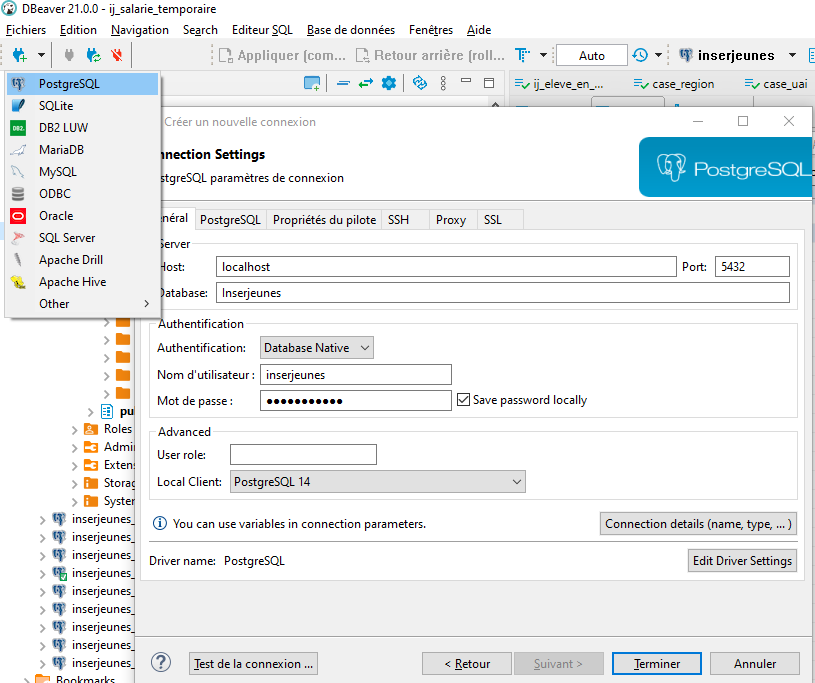
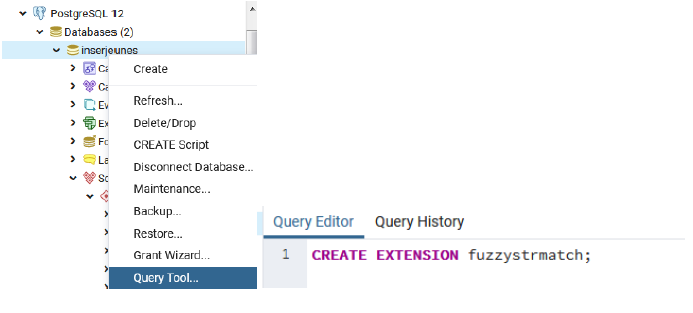
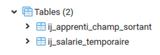
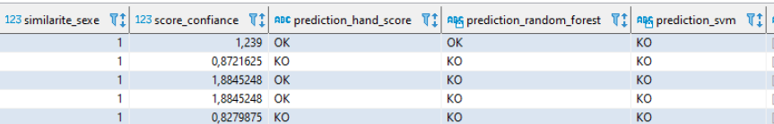

# Installation et utilisation de l’outil d’appariement
## 1. Installation et configuration de l'outil pour l’exemple
L’utilisation de cet outil requiert un contexte d'exécution :
* L’ensemble des programmes du dossier mis à disposition sur le Github (code source et script XML) : [https://gitlab.depp.education.fr](https://github.com/depp-innovation/)
* Une version de python 3.7 compatible avec les versions des packages dans le fichier [requirements.txt] mis à disposition sur le Github. 
Ce fichier permet d’exécuter l’ensemble des packages nécessaires au fonctionnement de l’outil d’appariement. 
Le plus simple est de télécharger la distribution Anaconda (https://www.anaconda.com/distribution/)
* Un accès à une base de données 

Dans ce document, l’appariement présenté en exemple est réalisé à partir de la méthode du hand score et repose sur des données fictives. 
Pour le réaliser, il vous faudra télécharger et installer au préalable :

* Un système de gestion de base de données : PostgreSQL (https://www.postgresql.org/download/)
* Un gestionnaire de base de données : pgAdmin ou équivalent (DBeaver)

### 1.1. Configuration de l'installation :
#### Packages python 
Ouvrez la console Anaconda. L'installation des dépendances de l’outil se fait par le gestionnaire de package python pip. Avec la commande « cd », inscrivez le chemin du dossier dans lequel vous avez placé le dossier «outil-record-linkage» contenant l’ensemble des programmes. 
Inscrivez ensuite la commande suivante dans la console afin de lancer le téléchargement des dépendances :  

   ```sh
cd X:\votre-chemin\outil-record-linkage
pip install -r requirements.txt
   ```

L’exécution de cette commande permet l’installation des packages au niveau global.
Si vous ne souhaitez les installer que pour une instance particulière de votre application, vous pouvez créer un environnement virtuel et l'activer.

#### Base de données
Pour notre exemple, nous allons prendre les valeurs de référence, également renseignées dans le fichier [.env](.env), et décrites ci-dessous pour la connexion au serveur depuis le gestionnaire de bases de données :
   
   ```conf
user="inserjeunes"
password="inserjeunes"
server="localhost"
port="5432"
database="inserjeunes"
schema="annee_2017_2018"
   ```



Une fois connecté à la base de données (« InserJeunes » dans notre exemple) dans le gestionnaire de bases de données (pgAdmin ou Dbeaver), 
vous devez dans un premier temps exécuter la commande sur la base de données  : 

   ```sql
CREATE EXTENSION fuzzystrmatch;
   ```


Ensuite, pour l’appariement utilisé dans l’exemple, il est nécessaire de créer une fonction de similarité de Levenshtein . Pour ce faire, vous devez : 
* Soit exécuter le script [scriptFonctionSimilariteLevenshtein.py](./exemples/scriptFonctionSimilariteLevenshtein.py) depuis la console anaconda
* Soit exécuter depuis le gestionnaire de base de données (à la suite de la commande CREATE EXTENSION fuzzystrmatch;) la commande ci-dessous :

   ```sql
DROP FUNCTION IF EXISTS public.levenshtein_similarity;

CREATE FUNCTION public.levenshtein_similarity(IN string_a text, IN string_b text)
    RETURNS numeric
    LANGUAGE 'plpgsql'
    AS $BODY$BEGIN
        return 1- CAST(levenshtein(string_a,string_b) as NUMERIC)/CAST(greatest(length(string_a),length(string_b)) as NUMERIC);
    END;$BODY$;

ALTER FUNCTION public.levenshtein_similarity(text, text)
    OWNER TO inserjeunes;
   ```

### 1.2	Création des tables de test 
Pour notre exemple, l’exécution du script [scriptCreationTablesBDD.py](exemples/scriptCreationTablesBDD.py) depuis la console Anaconda permet de créer les tables de tests sur lesquelles l’appariement est réalisé. 
Pensez à ajuster les valeurs de connexion du fichier [.env](.env) qui détermine l’environnement de travail afin que ces valeurs correspondent à votre configuration. 
Pour notre exemple la configuration est la suivante : 

   ```conf
3 user="inserjeunes"
4 password="inserjeunes"
5 server="localhost"
6 port="5432"
7 database="inserjeunes"
8 schema="annee_2017_2018"
   ```
L’exécution de ce script permet la création d’un schéma « annee_2017_2018 » et de deux tables suivantes :


### 1.3	Modification du fichier de configuration applicative

**Chemin dans le script de record linkage : 

Le script [recordLinkageToolMain.py](recordLinkageToolMain) permet de lancer par défaut l’appariement de notre exemple, dont les spécifications sont inscrites dans le fichier [specificationAppariement.xml](specificationAppariement.xml). 

Pour exécuter un autre script XML vous devez modifier la variable cheminXML (ligne 7) dans le script [recordLinkageToolMain.py](recordLinkageToolMain) de manière à ce que le chemin corresponde au script XML que vous souhaitez cibler : 

   ```conf
cheminXML = os.path.join(dir_path, "Nom_du_script")
   ```

## 2. Utilisation de l'outil à partir d’un exemple
### 2.1 Contexte
Cette application permet de réaliser un appariement entre deux sources de données et selon plusieurs méthodes d’appariement possibles. 
Dans l’exemple ci-dessous, nous réalisons un appariement avec la méthode du scoring manuel entre la table IJ_APPRENTI_CHAMP_SORTANT et la table IJ_SALARIE_TEMPORAIRE. L’outil est programmé pour d’abord réaliser un appariement « exact », c’est-à-dire pour constituer des paires d’individus entre les deux tables dont les variables spécifiées dans le XML sont identiques dans chacune des sources. 
L’outil réalise ensuite un appariement « approché » à partir des individus n’ayant pas formé de paires par l’appariement « exact ». 
Dans l’appariement « approché », l’outil mesure le degré de ressemblance entre les identifiants indirects sélectionnés pour l’appariement (dans notre exemple : nom, prénom, date de naissance, libellé de la commune de naissance et sexe). 
Cette mesure se fait par le calcul de similarités entre les identifiants indirects. Pour chacune des paires potentielles de l’appariement « approché », il est calculé un score global de similarité. 
Ce score de similarité est une fonction linéaire strictement croissante des similarités entre les paires. 
Ce score global de similarité est ensuite comparé à un seuil. Si le score global est supérieur au seuil, alors la paire est acceptée. 
A l’inverse, si le score global est inférieur au seuil, alors la paire est rejetée.
Le calcul de la fonction de similarité globale et la fixation du seuil se font de manière empirique, et nécessitent au préalable l’utilisation d’un échantillon d’entrainement pour trouver les meilleurs paramètres. 
Il existe de nombreuses mesures de similarité.     

### 2.2	Exécution de l’outil 
Pour que l'outil fonctionne, il faut lancer les scripts dans un ordre précis pour réaliser l’appariement de l'exemple :
Lancez le script de création de base de données [scriptCreationTablesBDD.py](exemples/scriptCreationTablesBDD.py). 
Il n’est pas nécessaire de modifier les paramètres du fichier [.env](.env), ils sont déjà renseignés avec les valeurs nécessaires à la réalisation de l’exemple.

#### <u>Etape 1 </u>
Après configuration de l'application, il faut lancer le script d’appariement [recordLinkageToolMain.py](recordLinkageToolMain).
Cela permet de lancer l’appariement exact, l’appariement approché, le calcul de similarité des paires et la classification par la méthode du hand score.
**Attention** : comme évoqué précédemment, le script est dépendant des spécifications portées dans le script [specificationAppariement.py](specificationAppariement.py). 
**A cette étape, nous avons déjà un premier résultat avec la méthode du hand score.**

#### <u>Etape 2 </u>
Lancez le script [scriptCreationTablesBDDannotation.py](exemples/scriptCreationTablesBDDannotation.py) qui permet la création des bases d’annotations. 

#### <u>Etape 3 </u>
Relancez le script[recordLinkageToolMain.py](recordLinkageToolMain). L'outil va reconnaitre que le XML n'a pas été modifié :
> prototypeRecordLinkage - INFO - la spécification …/specificationAppariement.xml a déjà été exécutée et le fichier XML n'a pas été modifié ..."
 
L’outil va donc charger la table "paires" (table temporaire dans le schéma public non définie dans le XML), relancer le calcul des similarités puis lancer toutes les méthodes de classification (dont celle qui nécessitait un échantillon de paires : Random forest et SVM). 
Les résultats affichés dans la console sont aussi stockés dans la log "prototypeRecordLinkage.log". Une log commentée est aussi disponible (log_commentee.log).
Nous avons à ce moment-là dans la table finale autant de colonnes de résultats disponibles que nous avons mis de classificateurs dans le fichier XML (3 classificateurs dans le XML fourni pour notre exemple).
Nous avons à cette étape, en plus du scoring manuel, deux résultats supplémentaires : un pour la méthode de Random forest et un pour le SVM linéaire. 
Ces deux méthodes de classification nécessitent un échantillon de paires (cf. point 3).

### 2.3	Exploitation des résultats 
Lorsque l'étape de scoring que vous souhaitez avoir est terminée (étape 1 ou étape 3), il suffit de vous connecter à la base de données dont les paramètres ont été spécifiés dans le fichier [.env](.env). 
Dans cette base de données, une table « paires_finales » a dû être créée.
Vous avez dans cette table toutes les combinaisons qui ont été testées lors de l'exécution de l'outil. Vous allez voir sur la même ligne les différents champs entre les deux sources. 
Vous pourrez ainsi valider visuellement les champs comparés (nom, prénom, date de naissance et commune du lieu de naissance) entre les deux sources, 
le score obtenu, et également voir si le matching entre les deux sources est accepté selon les différentes méthodes (hand score, Random forest ou SVM dans l’exemple ci-dessous).


Les résultats de l’appariement exact sont dans la table "resultat_appariement". 
Dans notre exemple, cette table est vide comme aucune des lignes des deux tables en entrée ne remplit les conditions de l’appariement « exact ». 
La table "paires_finales" contient le résultat de l’appariement approché avec :
* Les variables utilisées pour le calcul des similarités,
* Les similarités,
* Le score de confiance "score_confiance" et le résultat de l’appariement "prediction_hand_score".
**Attention** : les tables en input peuvent être modifiées par l’outil. En effet lorsque des paires d’individus sont retrouvées par l’appariement exact, ces mêmes individus sont supprimés dans les tables Input avant le début de l’appariement approché. 
En conséquence, si on veut relancer le processus complet (appariements exact + approché) il faut remettre les tables Input telles qu’elles étaient avant la première exécution du script [recordLinkageToolMain.py](recordLinkageToolMain) qui lance l’outil d’appariement.

## 3. Utilisation de l’outil avec d’autres données 
Un record linkage se fait par lancement de [recordLinkageToolMain.py](recordLinkageToolMain) en spécifiant dans ce script le chemin complet du XML de spécification de cet appariement. 
Cela implique de modifier le XML [specificationAppariement.xml](specificationAppariement.xml) fourni dans l’exemple pour l’adapter à vos données. Veillez à ce : 
* Que les informations dans le fichier .env soit correctement renseignées relativement à votre environnement de travail (champ XXXX à compléter) : 
   ```conf
3 user="XXXX"
4 password="XXXX"
5 server="XXXX"
6 port="XXXX"
7 database="XXXX"
8 schema="XXXX"
   ```
* Que les deux tables qu’on veut apparier en entrée (balise <inputTable>) soient correctement renseignées et **correspondent exactement** à ce qu’on trouve en base de données dans le gestionnaire de BDD.
   ```xml
<inputTable tableName="TABLE_1" primaryKeyName="VAR_CLE_PRIMAIRE_1">
		<column name="VAR_1"/>
		<column name="VAR_2"/>
		<column name="VAR_3"/>
                               <column name="VAR_X"/>   Etc… 
</inputTable>
<inputTable tableName="TABLE_2" primaryKeyName=" VAR_CLE_PRIMAIRE_2">
		<column name="VAR_1"/>
		<column name="VAR_2"/>
		<column name="VAR_3"/>
                               <column name="VAR_X"/>   Etc… 
</inputTable>
   ```
* Que les tables en sortie (balise <outputTables>) soient également correctement renseignées.
   ```xml
<outputTables exactRecordLinkageTableName="NOM_TABLE_LINK_EXACT"  *Contient les résultats de l’appariement exact
fuzzyRecordLinkageTableName=" NOM_TABLE_LINK_APP" /> *Contient les résultats de l’appariement approché
	<classificationEvaluationTable tableName="PAIRES_ANNOTATIONS" positive="OK" negative="KO" incertain="?" annotationColumnName="STATUT_ANNOTATION"/>
	<logParsedSpecification  verbosity="no"/>
   ```
**Attention** : il faut être sûr que les champs dans la balise <inputTable> correspondent à votre structure de bases de données. 
Il vous faut également mettre à jour la structure des tables de sortie <outputTables> que vous souhaitez obtenir et spécifier dans le champ adéquat quels champs sont comparés entre les sources. 

   ```
Dans le script XML de notre exemple, à la suite des spécifications pour les tables de sorties, Il y a deux balises : une pour l’appariement exact <exactRecordLinkage> et une pour l’appariement approché <fuzzyRecordLinkage>. C’est à cet endroit qu’il faut spécifier les modalités des appariements que vous souhaitez réaliser (variables, méthodes pour le calcul des similarités…). Vous devez spécifier les variables à partir desquelles vous souhaitez réaliser l’appariement ainsi que les méthodes de calcul de similarité les plus adaptées à vos données (balises <pairCreation> et <recordPairComparison>).
A la fin du script dans la balise </classification>, il s’agit enfin de spécifier le classificateur et ses paramètres pour l’appariement. Si vous souhaitez utiliser d’autres classificateurs que le hand score de l’exemple, il faudra ajuster en conséquence les scripts [scriptCreationTablesBDDannotation.py](exemples/scriptCreationTablesBDDannotation.py) et [specificationAppariement.xml](specificationAppariement.xml). 
Cela comprend par exemple, l’ajustement des valeurs pour la fonction de score (dans le fichier XML, vous avez un exemple ligne 163 précisant comment le score global de similarité est calculé) ainsi que l’ajustement de la valeur d'acceptation pour votre modèle. En fonction de vos connaissances, vous pouvez ajouter ou modifier les paramètres des autres modèles (Random forest et SVM linéaire).
   ```

#### <u>Etape 1 </u>
Pour le premier lancement d’une spécification XML (avec l’exécution du script [recordLinkageToolMain.py](recordLinkageToolMain)), les étapes suivantes sont exécutées :
* Appariement exact en bases de données (attention, les individus appariés par l’appariement exact sont ensuite supprimés des tables en input),
* Appariement approché en bases de données sur les individus non retrouvés par l’appariement exact,
* Calcul des similarités,
* Résultats de la classification hand score (uniquement si elle a été spécifiée dans le XML).

A cette étape, l’outil a donc déjà réalisé un appariement (par le classificateur du hand score) et le résultat figure dans la colonne « prediction_hand_score ». Selon le seuil d’acception du modèle spécifié dans le XML, l’outil indique OK et accepte la paire si le score global de similarité est supérieur au seuil. 
A l’inverse, la paire est refusée et indiquée comme KO si le score global de similarité lui correspondant est inférieur au seuil.

#### <u>Etape 2 </u>
Pour évaluer la qualité de l’appariement et ajuster les paramètres de l’appariement que vous avez réalisé (détermination du score global de similarité et seuil d’acceptation du modèle), vous pouvez effectuer une annotation des paires. 
Cette annotation repose sur la comparaison de l’acception (ou du rejet) des paires entre les prédictions calculées par l’outil (colonne « prediction_hand_score ») et le statut réel de la paire déterminé à la main par l’utilisateur (colonne « statut_annotation »). 
Cette comparaison permet d’obtenir ainsi quatre grandeurs :
* 1.	Les vrais positifs (VP),  
* 2.	Les faux positifs (FP),
* 3.	Les vrais négatifs (VN),
* 4.	Les faux positifs (FP).

Avec ces quatre grandeurs, il est ensuite possible de calculer des indicateurs de qualité de l’appariement (comme l’accuracy) . 
Ce processus d’échantillonnage est à réaliser par l’utilisateur et peut être réalisé plusieurs fois afin d’obtenir les indicateurs de qualité les plus élevés.
L’exécution du script scriptCreationTablesBDDannotation.py permet de créer une table PAIRES_ANNOTATIONS (balise <classificationEvaluationTable> dans le XML) :
   ```xml
<classificationEvaluationTable tableName="PAIRES_ANNOTATIONS" positive="OK"
negative="KO" incertain="?" annotationColumnName="STATUT_ANNOTATION"/>
   ```
Dans l’exemple ci-dessus la table avec les paires annotées est la table PAIRES_ANNOTATIONS. Vous la retrouverez dans votre gestionnaire de bases de données dans le même schéma que celui que vous aurez spécifié au préalable dans le fichier [.env](.env). 
Elle doit être faite par copier/coller d’une **partie** de la table spécifiée dans la balise <fuzzyRecordLinkageTableName>. 

#### <u>Etape 3 </u>
Enfin il faut relancer l’exécution de la même spécification. Les étapes suivantes sont exécutées :
* Calcul des similarités,
* Toutes les classifications (dont celles de machine learning telles que le Random forest ou le SVM linéaire si vous les avez spécifié dans le XML),
* Évaluation.
**NB** : l’étape de calcul des similarités n’est pas utile à relancer mais est conservée par simplicité, cette étape ne prenant que quelques minutes.

#### <u>Limites de l’outil</u>
1.	Le script fourni permet de réaliser le calcul des fonctions de similarité utilisées dans l’exemple : 
* Similarité de Jaro Winkler pour les noms et prénoms, 
* Similarité de Levenshtein pour  la commune du lieu de naissance,
* Similarité binaire pour le sexe, 
* Similarité créée spécifiquement pour InserJeunes pour la date naissance. 
D’autres calculs de similarité demeurent possibles mais restent à développer et l’outil pourrait par exemple être enrichi d’autres fonctions comme le calcul de similarité sur des adresses. 
2.	L’outil est parfaitement adapté aux données d’InserJeunes mais pourrait ne pas fonctionner lorsqu’il s’agit de réaliser de très gros appariements, par exemple entre deux sources de plusieurs dizaines de millions de lignes. 
Pour de tels appariements, le recours à match de matchID  est recommandé.
3.	L’outil d’appariement mis à disposition reposant sur la spécification d’un script XML, il doit respecter une grammaire formelle. 
L’utilisateur doit donc respecter le formalisme et le vocabulaire propre à l’outil pour réaliser un appariement à partir d’autres sources.